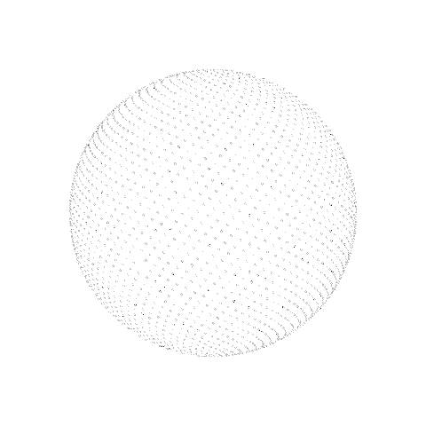

<table width="80%" align="center">
<tr>
<td width="42.5%" valign="top">

**General Purpose** 
&nbsp;
&nbsp;
&nbsp;

 

**Web Development** 
&nbsp;
&nbsp;
&nbsp;
&nbsp;

&nbsp;
&nbsp;
&nbsp;

 

**Databases** 
&nbsp;

 

**Infrastructure, Cloud & DevOps** 
&nbsp;
&nbsp;
&nbsp;
&nbsp;

 

**Functional** 
&nbsp;
&nbsp;
&nbsp;

</td>
<td width="100%" align="center" valign="middle">

</td>
</tr>
</table>
